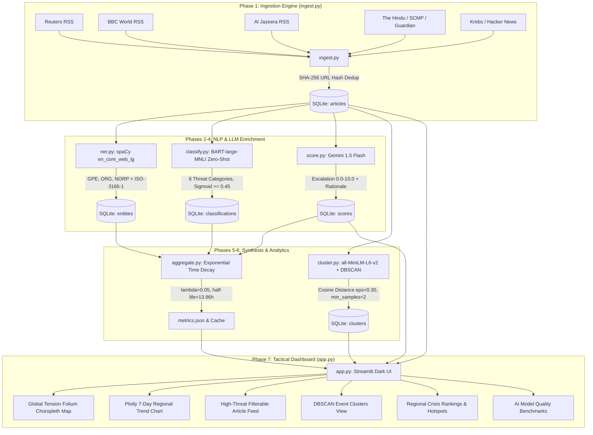
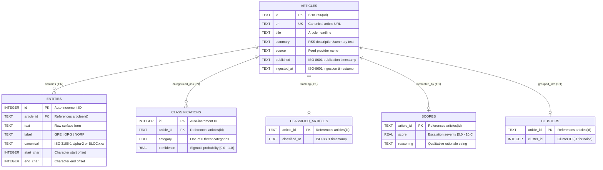

# System Architecture & Technical Specification

## Overview

**STRATINT** is an automated Open-Source Intelligence (OSINT) processing pipeline and tactical situational awareness dashboard. It ingests international security news from RSS feeds, extracts geopolitical entities, performs multi-label zero-shot threat classification, evaluates escalation severity via Google Gemini 1.5 Flash, clusters related reports into discrete crisis events using dense sentence embeddings with DBSCAN, and calculates decay-adjusted regional tension indices.

---

## High-Level Pipeline Flow

---

## Database Entity-Relationship Diagram

The SQLite database (`osint.db`) operates in **WAL (Write-Ahead Logging)** mode with foreign key enforcement enabled:

---

## Pipeline Component Specifications

### 1. Ingestion (`ingest.py`, `db.py`)
- **Monitored Feeds**: 10 feeds covering global wires, regional press, and cybersecurity (Reuters, AP News, BBC World, Al Jazeera, The Hindu, South China Morning Post, Kyiv Independent, The Guardian World, Krebs on Security, The Hacker News).
- **Deduplication**: Deterministic SHA-256 hashing of canonical URL with `INSERT OR IGNORE`.
- **Fault Tolerance**: 15s socket timeout wrapper per feed with isolated error capture.

### 2. Named Entity Recognition (`ner.py`)
- **Model**: spaCy `en_core_web_lg` (floret vectors, offline-ready).
- **Extracted Labels**:
  - `GPE`: Countries, sovereign states, cities.
  - `ORG`: Military units, rebel groups, government agencies, alliances.
  - `NORP`: Nationalities, religious/political factions.
- **Normalization**: ISO-3166-1 alpha-2 mapping via lookup dictionary and `pycountry`, plus regional bloc tags (`BLOC:EU`, `BLOC:NATO`, `BLOC:UN`, `BLOC:ASEAN`, `BLOC:BRICS`).

### 3. Multi-Label Threat Classification (`classify.py`)
- **Model**: `facebook/bart-large-mnli` zero-shot NLI pipeline on CPU.
- **Taxonomy (6 domains)**:
  1. `military conflict`
  2. `cyberattack`
  3. `civil unrest`
  4. `diplomatic tension`
  5. `terrorism or extremist violence`
  6. `natural disaster`
- **Thresholding**: Independent Sigmoid probability $\ge 0.45$ per category.

### 4. Escalation Scoring (`score.py`)
- **Model**: Google Gemini `gemini-1.5-flash` with structured few-shot prompt engineering.
- **Rate-Limiting**: Token bucket enforcing 14 requests/minute ceiling.
- **Fallback**: Automatic 429 quota backoff and local heuristic fallback (score 5.0).
- **Scale**: `0.0` (routine/background) to `10.0` (catastrophic/regional conflict).

### 5. Semantic Event Clustering (`cluster.py`)
- **Model**: `sentence-transformers/all-MiniLM-L6-v2` (384-dimensional dense vectors).
- **Vector Cache**: `data/embeddings.npz`.
- **Algorithm**: DBSCAN with cosine distance ($\varepsilon = 0.30$, $min\_samples = 2$). Singletons labeled as noise (`-1`).

### 6. Regional Tension Analytics (`aggregate.py`)
- **Decay Formula**:
  $$\text{Tension}(R) = \sum_{i \in R} \text{Score}_i \times w_c \times e^{-\lambda \Delta t}$$
  where $\lambda = 0.05$ ($t_{1/2} \approx 13.86\text{ hours}$) and $\Delta t$ is the article age in hours.
- **Category Weights ($w_c$)**:
  - Military Conflict: $1.5\times$
  - Terrorism: $1.3\times$
  - Cyberattack: $1.2\times$
  - Civil Unrest: $1.0\times$
  - Diplomatic Tension: $0.8\times$
  - Natural Disaster: $0.6\times$
- **GeoJSON**: Maps ISO alpha-2 codes to ISO-3166-1 alpha-3 codes for Folium choropleth mapping (`data/world_countries.json`).
